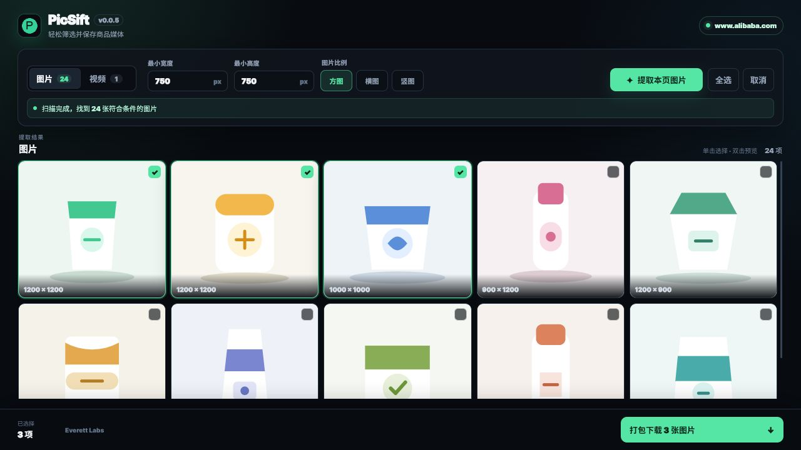

# PicSift

[](https://github.com/everett7623/PicSift/releases/latest)
[](https://developer.chrome.com/docs/extensions/develop/migrate/what-is-mv3)
[](LICENSE)

PicSift 是一个开源的 Chrome Manifest V3 扩展，用于从电商商品页筛选、预览并下载图片和直链视频。它面向外贸、电商运营、设计素材整理等需要批量保存商品媒体的场景。

当前版本：`v0.0.6`（Beta）



> 截图使用演示数据，界面结构和样式来自当前版本。

## 功能

- 扫描 ``、懒加载属性、CSS 背景图、页面元数据和已加载资源。
- 针对 Alibaba 新版页面补充结构化数据和内嵌脚本图片识别。
- 自动还原 Alibaba、淘宝、京东、Amazon、中国制造网等站点的高清图片 URL。
- 按最小宽度、最小高度和方图/横图/竖图筛选。
- 提取完成后可按 750+、800+、1000+、1500+ 和图片比例即时筛选结果。
- 单击选择、双击预览，支持全选和取消选择。
- 多张图片打包成一个 ZIP，只触发一次浏览器下载。
- 图片 ZIP 最大 256 MB；单个资源请求超时 20 秒，失败项可保留后重试。
- 支持商品页直链视频提取和批量下载。
- 全屏工作台自动记住来源商品页，刷新或重载扩展后可恢复连接。
- 仅接受 HTTP(S) 媒体地址，文件名会在下载前清理。

## 支持站点

| 站点 | 图片 | 高清 URL 优化 | 直链视频 | 说明 |
| --- | :---: | :---: | :---: | --- |
| Alibaba.com / 1688.com | ✅ | ✅ | ✅ | 页面元数据、资源和 Alicdn 规则优化 |
| AliExpress.com | ✅ | ✅ | 部分 | 采用阿里系规则 |
| Taobao.com / Tmall.com | ✅ | ✅ | 部分 | 商品主图和懒加载规则优化 |
| JD.com | ✅ | ✅ | 通用 | 京东图片参数优化 |
| Made-in-China.com | ✅ | ✅ | ✅ | 图片模板和视频属性优化 |
| Amazon.com | ✅ | ✅ | 通用 | Amazon 图片尺寸参数优化 |
| eBay.com / Shopee.com | ✅ | 通用 | 通用 | 依赖页面可见 DOM 和直链资源 |

站点页面结构会持续变化。动态内容建议先滚动到详情区域再提取；登录、安全验证、DRM 或 M3U8 流媒体不属于当前支持范围。

## 安装

### 从 Release 安装

1. 打开 [Releases](https://github.com/everett7623/PicSift/releases/latest)，下载 `PicSift-v0.0.6.zip`。
2. 解压 ZIP。
3. 打开 `chrome://extensions/` 并启用“开发者模式”。
4. 点击“加载已解压的扩展程序”，选择解压后的目录。
5. 将 PicSift 固定到浏览器工具栏。

### 从源码安装

```bash
git clone https://github.com/everett7623/PicSift.git
```

然后在 `chrome://extensions/` 中加载仓库根目录。详细步骤见 [INSTALL.md](INSTALL.md)。

## 快速使用

1. 打开受支持的商品详情页，等待主图和详情图加载。
2. 点击 PicSift 图标，扩展会在新标签页打开全屏工作台。
3. 设置最小尺寸和图片比例，点击“提取本页图片”。
4. 单击卡片选择，双击查看原图。
5. 选择多张图片后点击“打包下载”；单张图片或视频直接下载。

完整说明和故障排查见 [USAGE.md](USAGE.md)。

## 权限与隐私

| 权限 | 用途 |
| --- | --- |
| `activeTab` | 用户点击扩展时识别当前商品页 |
| `scripting` | 内容脚本丢失时重新注入受支持页面 |
| `downloads` | 保存单个媒体文件或生成的 ZIP |
| `storage` | 保存筛选条件和工作台标签页状态 |
| `host_permissions` | 仅访问 `manifest.json` 中声明的电商站点 |

PicSift 不包含服务端，不上传提取结果、浏览记录或下载内容。所有扫描、筛选和 ZIP 生成均在浏览器本地完成。

## 开发

项目无构建步骤、无运行时第三方依赖。

```bash
node --check content/content.js
node --check popup/popup.js
node --check background/background.js
node --test tests/*.test.js
python -m json.tool manifest.json
bash test.sh
```

修改代码后，需要在 `chrome://extensions/` 重新加载扩展。详细回归用例见 [TESTING.md](TESTING.md)。

## 架构

```text
浏览器图标
  └─ background/background.js 打开或复用全屏工作台
       └─ popup/popup.js 向来源商品页发送提取消息
            └─ content/content.js 扫描、标准化和筛选媒体
       └─ popup/popup.js 本地生成多图 ZIP
       └─ background/background.js 下载单个图片或视频
```

## 项目文档

- [安装指南](INSTALL.md)
- [使用指南](USAGE.md)
- [测试指南](TESTING.md)
- [更新日志](CHANGELOG.md)
- [发布说明](RELEASE.md)
- [开发说明](CLAUDE.md)

## 路线图

- 图片内容级去重（感知哈希）
- 导出图片 URL（CSV/TXT）
- 自定义文件名模板
- SKU 图片分类
- 商品标题、价格和参数提取
- M3U8 视频流下载

## License

[MIT License](LICENSE) © 2026 Everett Labs

作者：everettlabs · 邮箱：[everett7623@gmail.com](mailto:everett7623@gmail.com)

项目主页：[Everett Labs](https://everettlabs.dev/)
